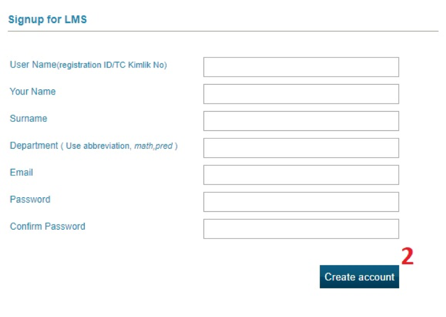

# CET LMS

## Hesap Bilgileri
<router-link to="#nasil-uye-olunur">Nasıl üye olunur?</router-link>  
<router-link to="#sifreni-unuttum-nasil-giris-yaparim">Şifreni unuttum. Nasıl giriş yaparım?</router-link>  
<router-link to="#kisisel-bilgilerimi-nasil-degistiririm">Kişisel bilgilerimi nasıl değiştiririm?</router-link>  
### Nasıl üye olunur?
Sayfada yer alan “Signup” yazısına tıklayın. Bilgileri girdikten sonra “Create account” butonuna basın.

 

### Şifreni unuttum. Nasıl giriş yaparım?
“Forgot Password?” yazısının üstüne tıklayın. Açılan sayfaya sistemde kayıtlı olan e-posta adresinizi girin ve “send” butonuna basın. E-posta adresinize şifrenizi sıfırlama linki gelecek. Bu link sayesinde yeni bir şifre belirleyebilirsiniz.

 

### Kişisel bilgilerimi nasıl değiştiririm?
Sisteme giriş yaptıktan sonra, “Personal Information” başlığına tıklayarak değiştirmek istediğiniz bilgilerinizi değiştirebilirsiniz.

 

 <router-link to="#cet-lms" style="float: right;">Başa Dön</router-link> 
## Dersler
 
<router-link to="#ders-nasil-eklenir">Ders nasıl eklenir?</router-link>  
<router-link to="#odevi-nasil-yuklerim">Ödevi nasıl yüklerim?</router-link>  
<router-link to="#yukledigim-odevi-nasil-tekrar-indiririm">Yüklediğim ödevi nasıl tekrar indiririm?</router-link>  
<router-link to="#ogretmenin-yukledigi-materyallere-nereden-ulasabilirim">Öğretmenin yüklediği materyallere nereden ulaşabilirim?</router-link>  

### Ders nasıl eklenir?
Sisteme giriş yaptıktan sonra, “Add new course” yazısına basın. Açılan sayfadan eklemek istediğiniz dersi seçin ve “Add” butonuna basın. Eklemek istediğiniz dersi veren hoca isteğinizi onayladıktan sonra ders, ders listenize eklenmiş olacak.

 

### Ödevi nasıl yüklerim?
Yüklemek istediğiniz ödevin altına gelip “Upload” yazısına basın. Daha sonra yüklemek istediğiniz dosyayı seçin. Son olarak da “Post” butonuna tıklayarak ödevinizi yükleyebilirsiniz.

 

### Yüklediğim ödevi nasıl tekrar indiririm?
Yüklediğiniz ödevin olduğu kısma gelip “Download your material” yazısına tıklayın. Ödeviniz tarayıcınız üzerinden inmeye başlayacak.

 

### Öğretmenin yüklediği materyallere nereden ulaşabilirim?
“Course Materials” başlığına tıklayın. İndirmek istediğiniz materyali seçin.

 

 <router-link to="#cet-lms" style="float: right;">Başa Dön</router-link> 

## Notlar ve Duyurular
 
<router-link to="#aldigim-puanlara-nereden-ulasabilirim">Aldığım puanlara nereden ulaşabilirim?</router-link>  
<router-link to="#duyuru-veya-ilan-nasil-paylasilir">Duyuru veya ilan nasıl paylaşılır?</router-link>  
<router-link to="#dersle-ilgili-arkadaslarima-nasil-mesaj-atabilirim">Dersle ilgili arkadaşlarıma nasıl mesaj atabilirim?</router-link>  

### Aldığım puanlara nereden ulaşabilirim?
Ödevlerden aldığınız puanlara ulaşmak için “Grades” başlığını seçin. Bu kısımda derse katkı sağladığınız tüm basamaklarla ilgili aldığınız puanları okul puanınızın hizasında görebilirsiniz.

 

### Duyuru veya ilan nasıl paylaşılır?
Sayfanın üst kısmında yer alan “Announcements” başlığına tıklayın. Açılan sayfada “Add New Announcement” yazısına tıklayın. Yayınlamak istediğiniz duyuru veya ilanın başlığını ve içeriğini girdikten sonra “Post” butonuna tıklayın.

 

### Dersle ilgili arkadaşlarıma nasıl mesaj atabilirim?
“Contact” başlığı seçin. Mesaj göndermek istediğiniz kişi veya kişileri “Choose” yazısına tıklayarak seçin. Mesajınızın başlığını ve içeriğini girdikten sonra “Send” butonuna tıklayın.

 

 <router-link to="#cet-lms" style="float: right;">Başa Dön</router-link> 