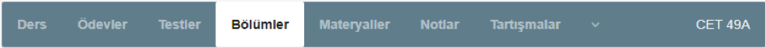
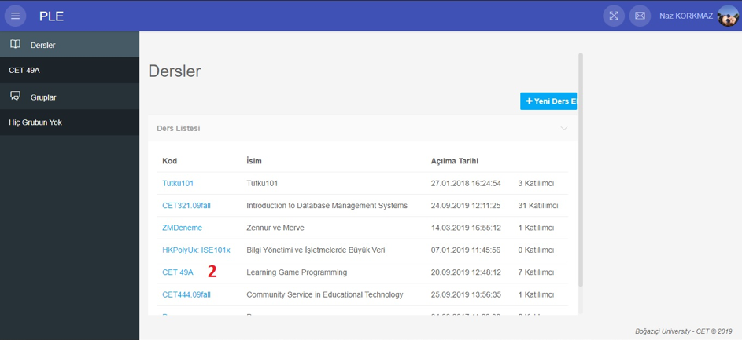
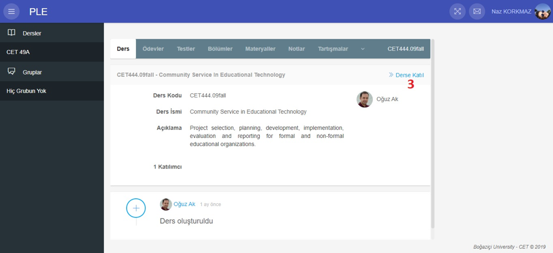
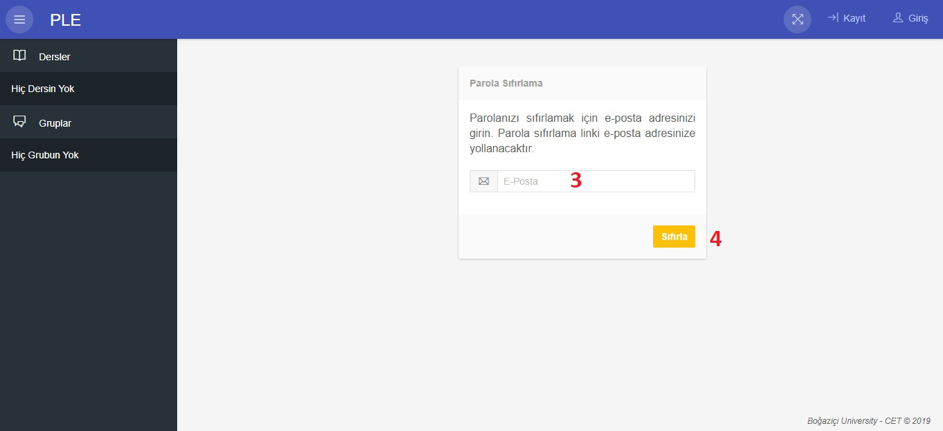

# PLE
## Sol Menü

## Dersler
Dersler başlığının altında bulunduğunuz dönem eklediğiniz dersler yer almaktadır.

## Gruplar
Gruplar başlığının altında bulunduğunuz dönem katıldığınız gruplar yer almaktadır.

## Ders
Ders başlığı altında o ders ile ilgili bilgilere ve katılımcı sayısına ulaşabilirsiniz.

## Ödevler
Ödevler başlığının altında o ders için öğretmenin eklediği ödevlere ve son yükleme tarihine ulaşabilirsiniz.

## Testler
Testler başlığının altında o ders için öğretmenin eklediği testlere ulaşabilirsiniz.

## Bölümler
Bölümler başlığı altından o ders için öğretmenin girmiş olduğu bilgilere ulaşabilirsiniz.

## Materyaller
Materyaller başlığı altından o ders için öğretmenin yüklemiş olduğu ders için gerekli materyellere ulaşabilirsiniz.

## Notlar
Notlar başlığı altından öğretmenin verdiği ödevlerin veya sınavların sonuçlarına ulaşabilirsiniz.

## Tartışmalar
Tartışmalar başlığı altından dersle ilgili tartışmalara katılabilir veya yeni bir tartışma başlatabilirsiniz.

## Katılımcılar
Katılımcılar başlığı altından dersi alan diğer öğrencileri görebilir, onların iletişim bilgilerine ulaşabilirsiniz.

## Mesajlar
Mesajlar başlığı altından yeni mesaj oluşturabilir, “Gelen” kısmından gelen mesajları, “Okunmamış” kısmından okunmamış mesajlara ve “Gönderilen” kısmından da göndermiş olduğunuz mesajlara ulaşabilirsiniz.

## Simgeler
- icon
Bu simge ile sayfanın sol tarafında yer alan menüsünü kapatıp açabilirsiniz.
- icon
Bu simge ile sayfayı tam ekran yapabilir ve “Esc” tuşu ile tam ekran modundan çıkabilirsiniz.
- icon
Bu simge ile mesajlarınıza ulaşabilirsiniz.
- icon
Ders hakkında yapılan değişiklikleri gösteren simge.

## SSS
### Sistem üzerinden nasıl mesaj gönderirim?
Sisteme giriş yaptıktan sonra, sayfanın sağ üst tarafında yer alan mektup şeklindeki butona tıklayın. Açılan sayfada “Yeni” butonuna tıklayın.

###  Sistemden Nasıl Çıkış Yaparım?
Sistemden çıkış yapabilmek için ekranın sağ üst köşesinde bulunan isminize tıklayarak açılan menüden “Çıkış” butonuna tıklayabilirsiniz.

### Dersten Nasıl Ayrılırım?
Sisteme giriş yaptıktan sonra, ekranın sol kısmında bulunan menüden dersi seçin. Açılan sayfada menüde bulunan “Ders” başlığını seçin. Ders bilgilerinin bulunduğu sayfanın sağ tarafında bulunan “<< Dersten Ayrıl”  butonuna tıkladıktan sonra dersten ayrılabilirsiniz.

### Dersi beraber aldığım bir arkadaşımın iletişim bilgilerine nasıl ulaşabilirim?
Sisteme giriş yaptıktan sonra, sol menüden dersi seçin. Açılan sayfadan başlıklardan “Katılımcılar” başlığını seçin. Açılan sayfada iletişim bilgisine ulaşmak istediğiniz arkadaşınızın ismine tıklayarak iletişim bilgilerine ulaşabilirsiniz.

### Aldığım notları nereden öğrenebilirim?
Sisteme giriş yaptıktan sonra, sol tarafta bulunan menüden dersinizi seçin. Açılan sayfadan “Notlar” başlığını seçin.

### Yeni aldığım dersi nasıl eklerim?
Sisteme giriş yaptıktan sonra, “Dersler” başlığı altıdan “Yönettiğin ve katıldığın dersleri görmek için buraya tıkla.” yazan kısma tıklayın. Ders listesinden eklemek istediğiniz dersi seçin. Açılan sayfadan “Derse katıl” butonuna tıklayın.

### Profil bilgilerimi nasıl düzenlerim?
Sisteme giriş yaptıktan sonra, sağ üst köşede bulunan isminize tıklayın. Açılan menüden “Profil” başlığını seçin. Açılan sayfada kalem simgesine tıklayarak profil bilgilerinizi güncelleyebilirsiniz.

### Sisteme nasıl kayıt olurum?
Sayfanın sağ üst tarafında bulunan “Kayıt” butonuna tıklayın. Açılan sayfada bilgilerinizi girin. “Kayıt Ol” butonuna tıklayın.

### Şifremi unuttum ne yapabilirim?
Sayfada yer alan şifremi unuttum yazısına tıklayın. Açılan sayfada sistemde kayıtlı e-posta adresinizi girerek sıfırla butonuna basın. Sistem parolanızı sıfırlamak için bir mail gönderecektir. Gelen maildeki linke tıklayarak yeni bir şifre oluşturunuz.

