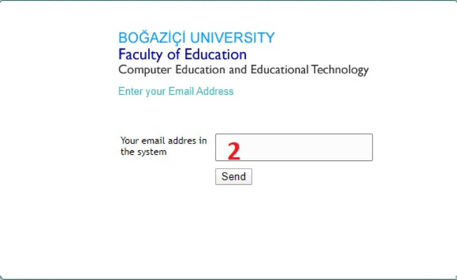
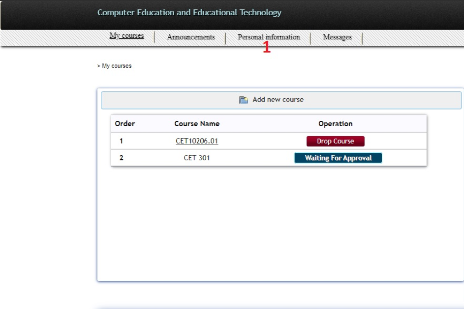
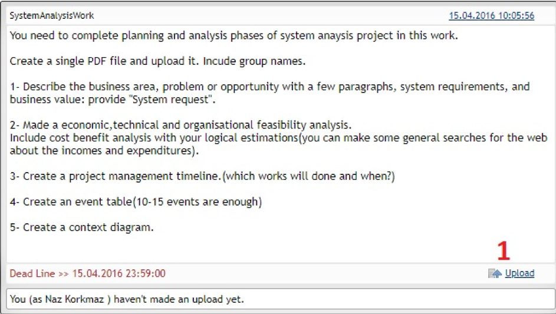

# CET LMS

## Account
<router-link to="#how-can-i-sign-up">How can I sign up?</router-link>  
<router-link to="#i-forgot-my-password-how-can-i-login">I forgot my password. How can I login?</router-link>  
<router-link to="#how-can-i-change-my-personal-information">How can I change my personal information?</router-link>  
### How can I sign up?
Click "Sign Up", then after entering the information, click “Create account” button.

 

### I forgot my password. How can I login?
Click "Forgot Password", then on the page that open you should enter your registered e-mail into the system and click "Send" button. You will recieve e-mail, you can determine new password.

 

### How can I change my personal information?
After login into the system, you can change the information by clicking on “Personal Information” link.

 

## Lessons
 
<router-link to="#how-can-i-add-lesson">How can I add lesson?</router-link>  
<router-link to="#how-can-i-upload-my-homework">How can I upload my homework?</router-link>  
<router-link to="#how-can-i-download-the-assignment-again">How can I download the assignment again?</router-link>  
<router-link to="#where-can-i-access-the-materials-that-the-teacher-has-uploaded">Where can I access the materials that the teacher has uploaded?</router-link>  

### How can I add lesson?
After login into the system, click “Add new course”. Select the course you want to add on the page that open and click the “Add” button. After the instructor approves your request, the course will be added to your list of courses.

 

### How can I upload my homework?
Go to the bottom of the assignment you want to upload and click “Upload”. Then, select the file that you want to upload. Finally, you can upload your homework by clicking on the” Post " button.

 

### How can I download the assignment again?
Click on “Download your material”. Your assignment will begin to download via your browser.

 

### Where can I access the materials that the teacher has uploaded?
Click on” Course Materials". Select the material you want to download.

 

## Notes and Announcement
 
<router-link to="#where-can-i-get-my-notes">Where can I get my notes?</router-link>  
<router-link to="#how-is-the-announcement-or-announcement-shared">How is the announcement or announcement shared?</router-link>  
<router-link to="#how-can-i-text-my-friends-about-the-lesson">How can I text my friends about the lesson?</router-link>  

### Where can I get my notes?
Click the heading “Grades” to reach the scores you get from the assignments. In this section, you can see the scores you received for all the steps you contributed to the course at the level of your school number.

 

### How is the announcement or announcement shared?
Click on “Announcements” at the top of the page. Click “Add New Announcement” on the page that opens. After entering the title and content of the announcement that you want to publish, click on the “Post” button.

 

### How can I text my friends about the lesson?
Click the title ”Contact". Select the person or people you want to send a message to by clicking on “Choose”. After entering the title and content of your message, click on the “Send” button.

 

