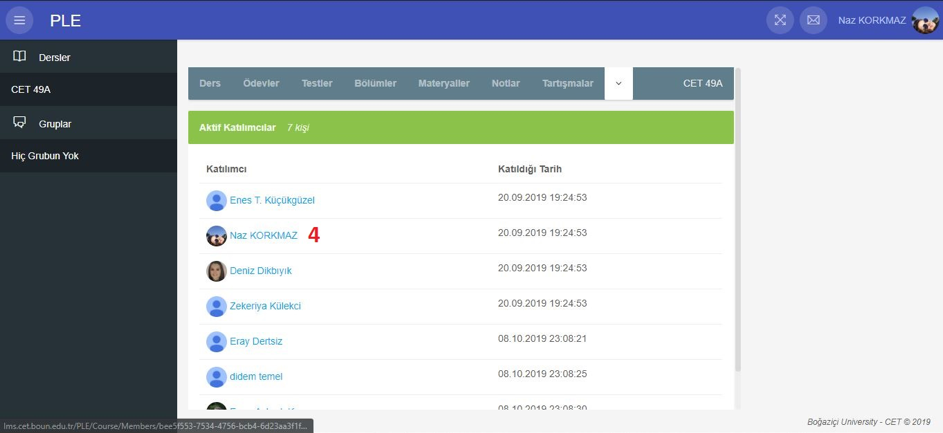

# PLE

## Lessons
You can see your current semester and courses you have added.

<router-link to="#groups">Groups</router-link> |
<router-link to="#course">Course</router-link> |
<router-link to="#homeworks">Homeworks</router-link> |
<router-link to="#tests">Tests</router-link> |
<router-link to="#sections">Sections</router-link> |
<router-link to="#materials">Materials</router-link> |
<router-link to="#results">Results</router-link> |
<router-link to="#discussions">Discussions</router-link>
<router-link to="#participants">Participants</router-link> |

### Groups
Under the Groups title, you can see your current semester and groups you have joined.

### Course
You can see the information about courses and number of participants.

### Homeworks
You can see the assignments and deadlines for that course.

### Tests
You can see the tests for that course.

### Sections
You can see the information that are added by teacher.

### Materials
You can see the materials that are uploaded by teacher for the course.

### Results
You can see the results of exam and homeworks.

### Discussions
You can join discussions or start a new discussion with other participants.

### Participants
You can see the other participants for the course, and their contact information.

 ## Left Menu

## Messages
You can create a new message. You can access the messages from the ”Incoming” section, the unread messages from the “Unread” section and the messages you have sent from the “Sent” section.

## Icons
::: tip
>

With this icon you can close and open the menu on the left side of the page.
:::
::: tip
>

With this icon you can make the page full screen and exit the full screen mode with the “Esc” key.
:::
::: tip
>

You can access your messages with this icon.
:::
::: tip
>

This icon shows us changes about the courses.
:::

## FAQ
<router-link to="#how-do-i-send-messages-over-the-system">How do I send messages over the system?</router-link>  
<router-link to="#how-do-i-log-out">How do I log out?</router-link>  
<router-link to="#how-do-i-leave-the-course">How do I leave the course?</router-link>  
<router-link to="#how-can-i-access-the-contact-information-of-other-participant-for-the-course">How can I access the contact information of other participant for the course?</router-link>  
<router-link to="#where-can-i-learn-my-notes">Where can I learn my notes?</router-link>  
<router-link to="#how-can-i-add-my-new-course">How can I add my new course?</router-link>  
<router-link to="#how-do-i-edit-my-profile-information">How do I edit my profile information?</router-link>  
<router-link to="#how-do-i-register">How do I register?</router-link>  
<router-link to="#what-can-i-do-when-forgot-my-password">What can I do when forgot my password?</router-link>  

### How do I send messages over the system?
After log in, click the letter-shaped button at the top right of the page. On the page that opens, click the "New" button.

###  How do I log out?
To log out the system, you can click the "Name" section on the top right corner, then you can click the "Exit" button from the drop-down menu.

### How do I leave the course?
After login, you should select the lesson on the left side of the screen. Then, you should click "Course" title and you can leave the course after clicking the “<< Leave Course” button on the right side of the page where the course information is located.

### How can I access the contact information of other participant for the course?
After login, you should select the course on the left menu. Then, you should the "Participants". There are contact informations about other participants. You can find who you want to reach.

### Where can I learn my notes?
After login, you should select course. You can see notes/results about the course on the opened page

### How can I add my new course?
After login the system, click on “Lessons” then select “Click here to see the courses you have managed and attended". You can select the course you want to add from the course list. You should click the "Join" button.

### How do I edit my profile information?
After login, you can click your name on the top right corner. Select “Profile" title from the drop-down menu. You can update your profile information by clicking the pencil icon on the page.

### How do I register?
You can click “Register” button on the top right corner. Enter your information in the page that opens. Click the “Register” button.

### What can I do when forgot my password?
You should click the "Forgot my password" then write e-mail address that registered in the system and click "Reset" button. System will send you an email to reset your password. Create a new password by clicking the link in the mail.

